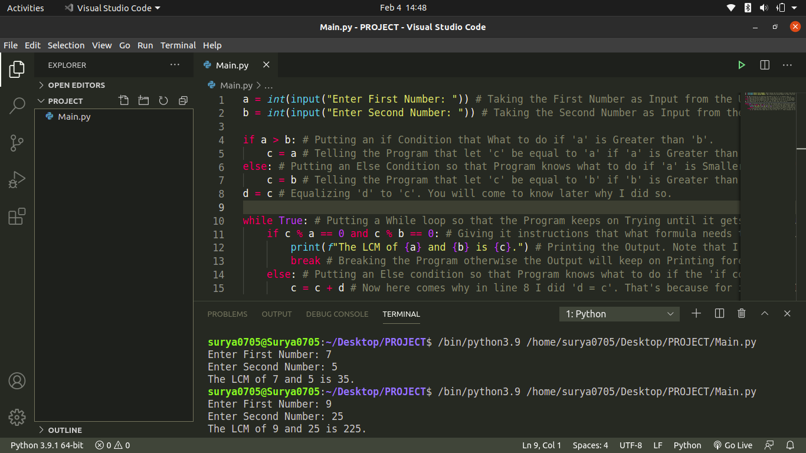
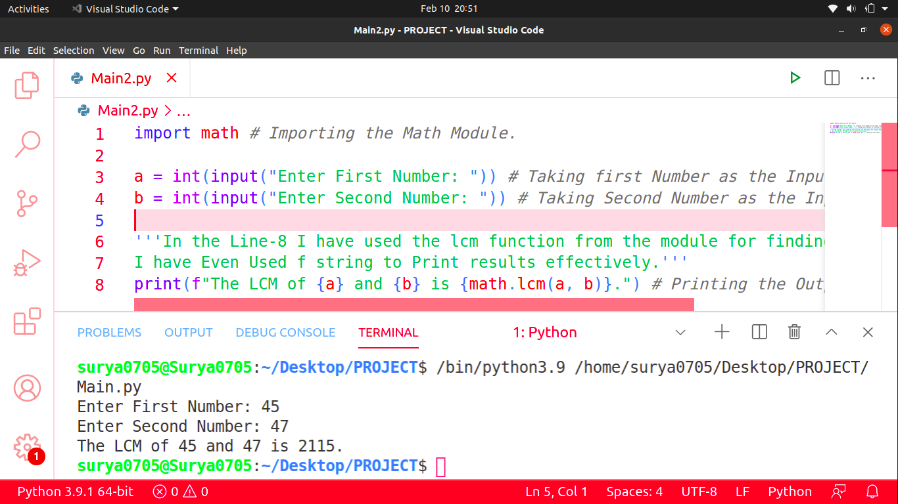

# LCM_Using_Python
This is a Python Program that gives out LCM (Lowest Common Multiple) of Two Numbers as Output. There are two ways to do this. They are Mentioned Below:
1. First is to Use No Module and Just do that with Code. Below is the Screenshot of for First Method:

2. Second is to use a built-in module called math which would be Present in your system as well if you have installed Python Correctly. Below is the Screenshot for the Second Method:

Hope that you Liked it.
